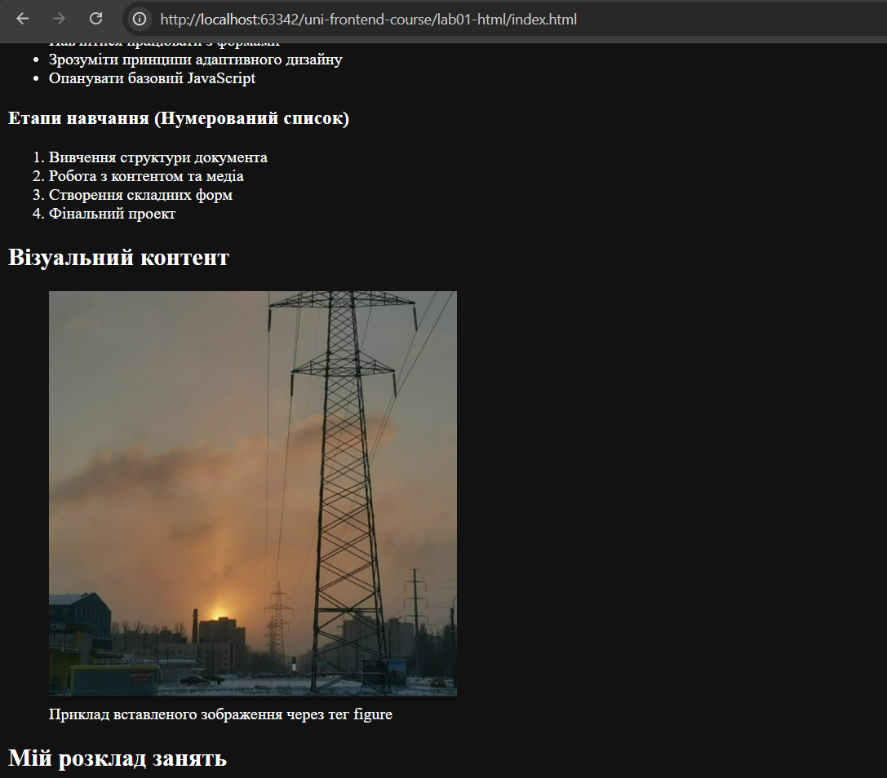
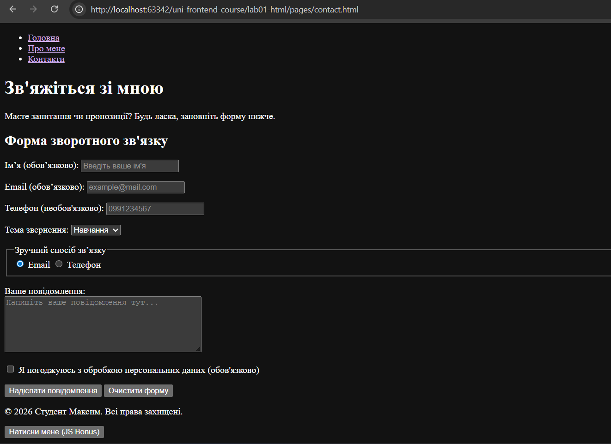
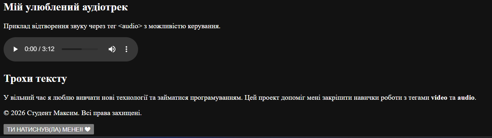

# Практична робота №1: Основи HTML

Цей проект є міні-сайтом, створеним в межах вивчення дисципліни "Створення Web-сайтів (Front-end)". Він демонструє базові навички роботи з HTML5, семантичною розміткою, формами та мультимедійними елементами.

## Структура проекту
- `index.html`: Головна сторінка з основною інформацією, списками та таблицею.
- `pages/about.html`: Сторінка "Про мене", що містить відео та аудіо плеєри.
- `pages/contact.html`: Сторінка контактів із повноцінною HTML-формою.
- `app.js`: JavaScript-файл з базовою інтерактивністю (бонусне завдання).
- `assets/`: Папка для зберігання зображень та медіа-файлів.

## Як запустити
1. Клонуйте репозиторій.
2. Відкрийте файл `index.html` у будь-якому сучасному браузері.
3. Для перегляду медіа-файлів переконайтеся, що відповідні файли (`koma.mp4`, `favorite_track.mp3` тощо) знаходяться в папці `assets/media/`.

## Скріншоти роботи

---
**Виконав:** Студент Максим
**Рік:** 2026
