# Практична робота №2: Основи CSS. Оформлення багатосторінкового HTML-сайту

Цей проект є розвитком міні-сайту з практичної роботи №1. У цій частині додано зовнішні таблиці стилів для повного візуального оформлення та адаптивності під різні розміри екранів.

## Основні зміни (Lab 02)
- Створено папку `styles/` з файлами `style.css` (основні стилі) та `responsive.css` (адаптивність).
- Використано **CSS Variables** для керування кольоровою палітрою та системними параметрами.
- Реалізовано горизонтальне меню навігації та медіа-блоки за допомогою **Flexbox**.
- Додано оформлення для всіх основних елементів: заголовків, списків, зображень, таблиць та форм.
- Реалізовано адаптивний дизайн за допомогою **Media Queries** для мобільних пристроїв та планшетів.
- Додано стани наведення (:hover) та фокусу (:focus) для кнопок, посилань та полів форми.

## Структура проекту
- `index.html`: Головна сторінка зі стилізованими списками, таблицею та картками.
- `pages/about.html`: Сторінка "Про мене" з адаптивними відео та аудіо плеєрами.
- `pages/contact.html`: Сторінка контактів із повноцінною та стилізованою HTML-формою.
- `styles/style.css`: Основна таблиця стилів з глобальними налаштуваннями та дизайном компонентів.
- `styles/responsive.css`: Стилі для адаптації під різні розміри екранів.
- `app.js`: JavaScript-файл з базовою інтерактивністю.
- `assets/`: Папка для зберігання зображень та медіа-файлів.

## Як запустити
1. Відкрийте файл `index.html` у будь-якому сучасному браузері.
2. Для перегляду медіа-файлів переконайтеся, що відповідні файли знаходяться в папці `assets/media/`.

## Скріншоти (Приклади оформлення)
- [Desktop-версія]
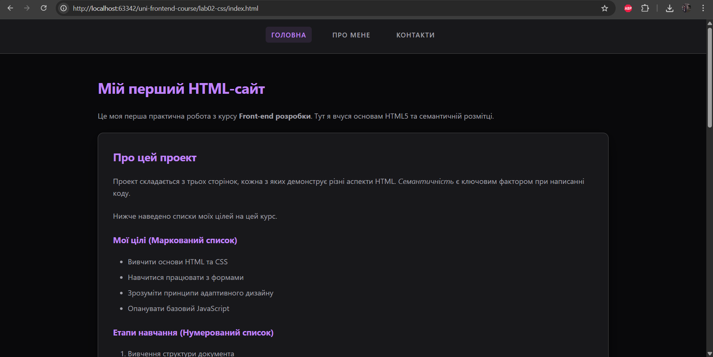
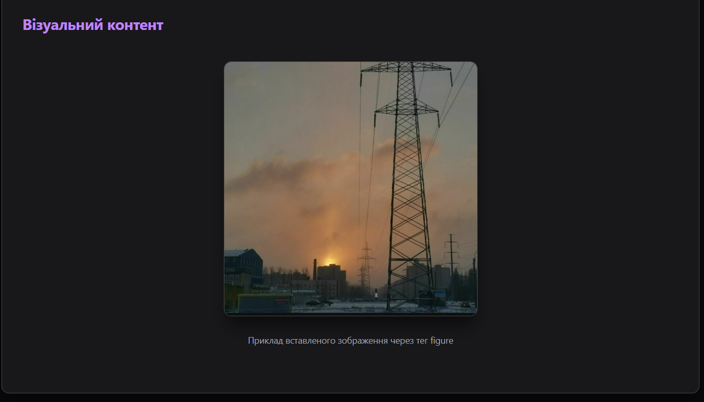
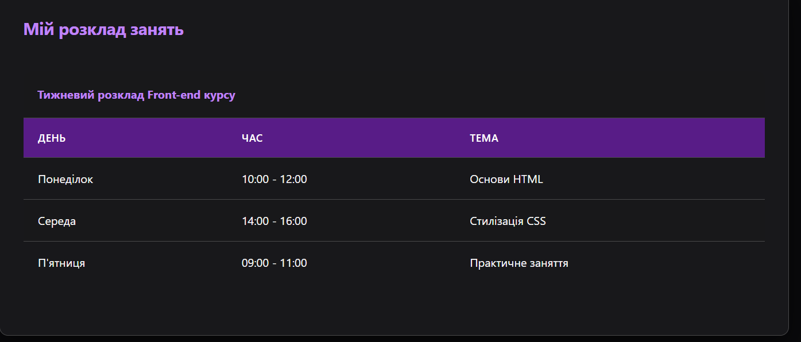
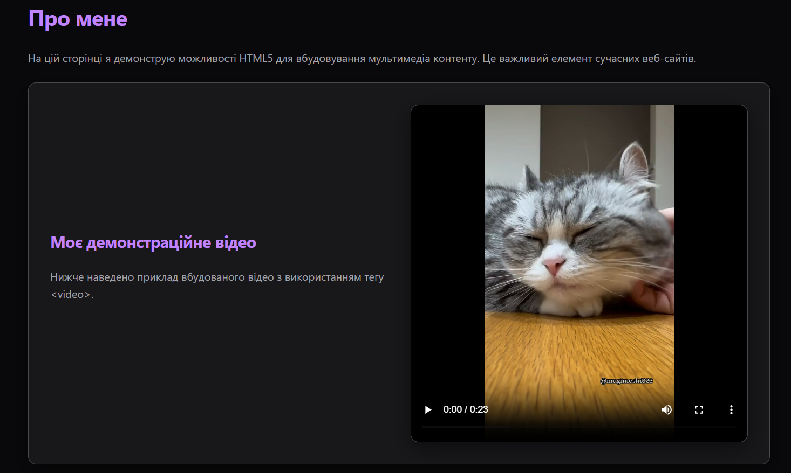
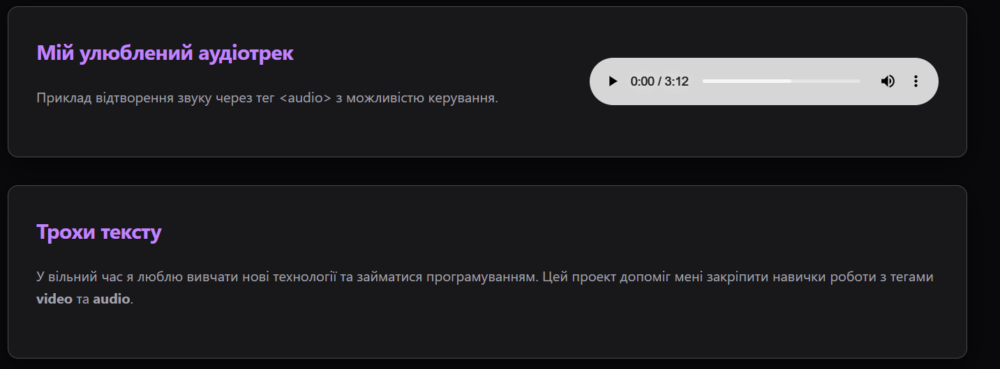
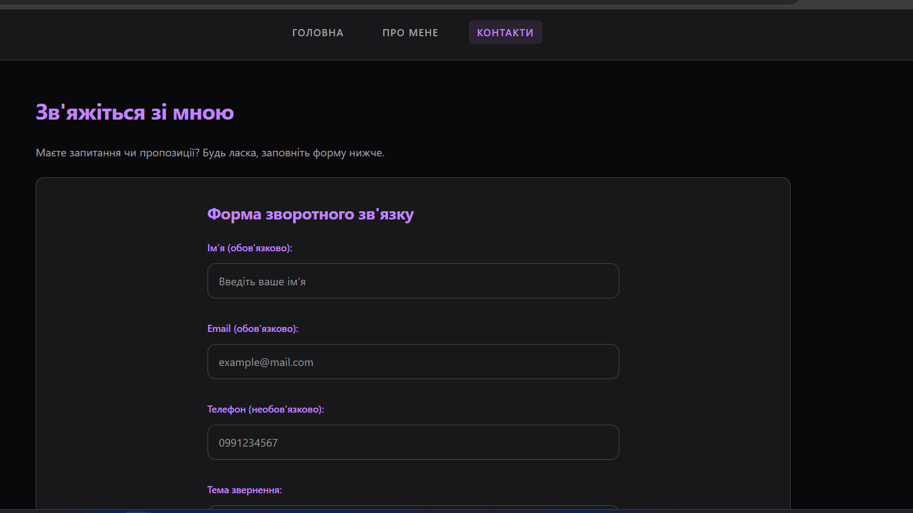
- [Mobile-версія]
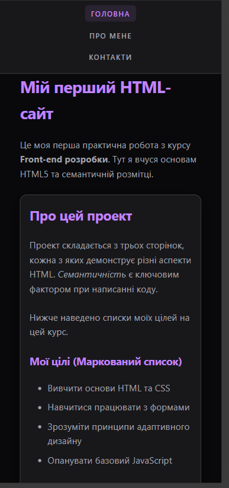
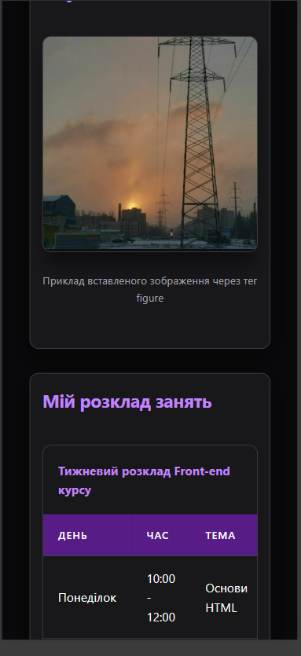
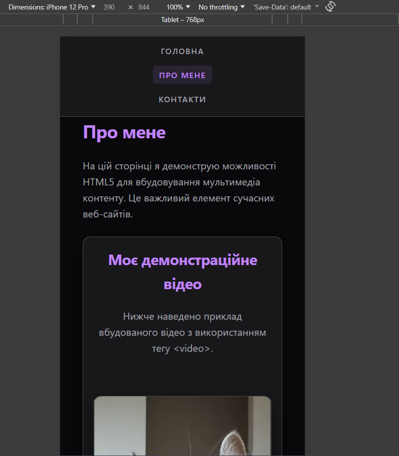
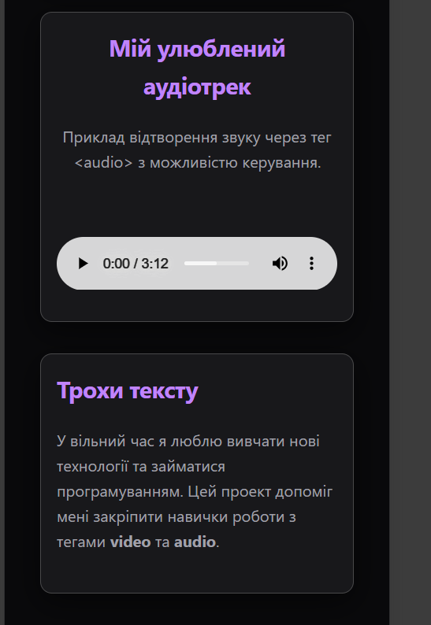
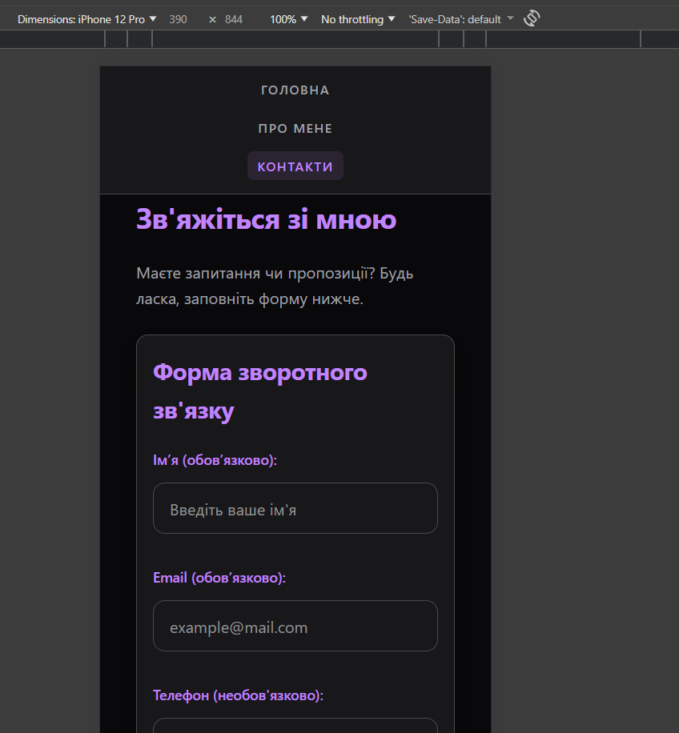
---
**Виконав:** Студент Максим
**Рік:** 2026
