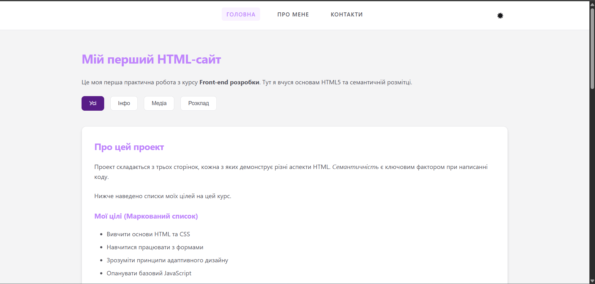
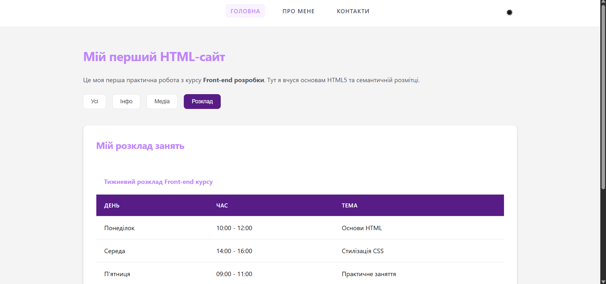
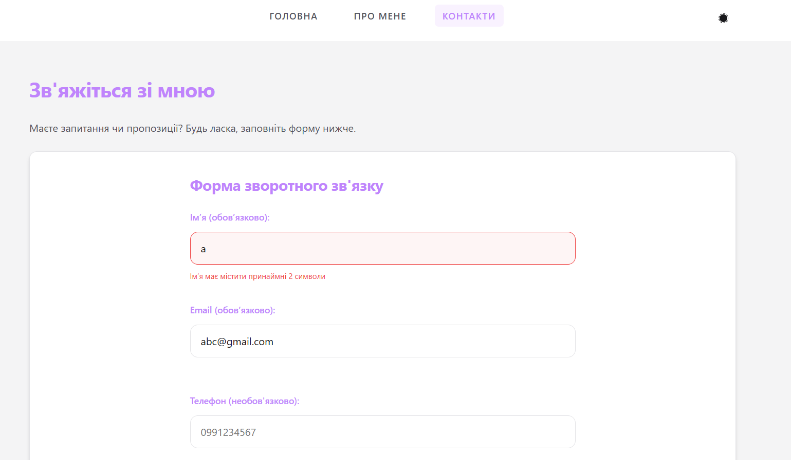
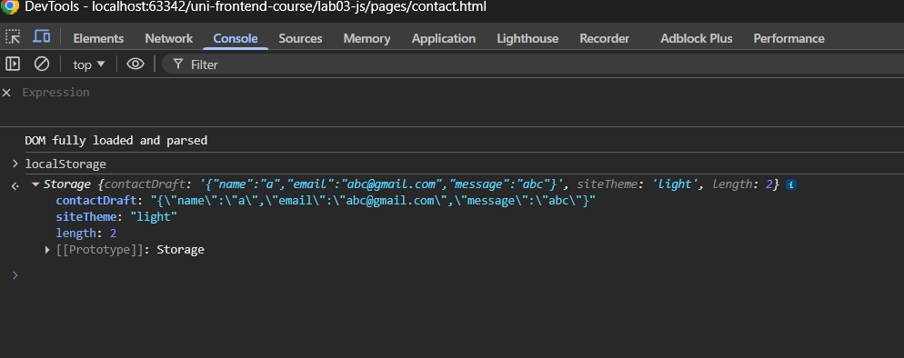
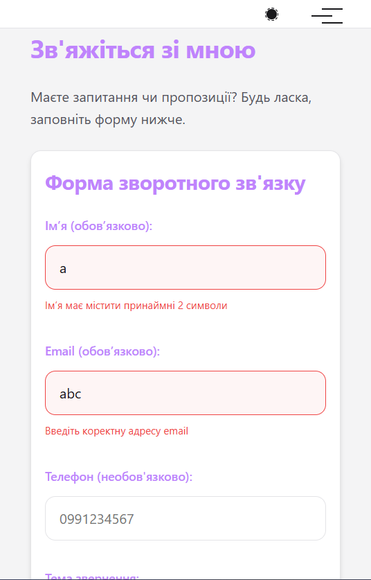
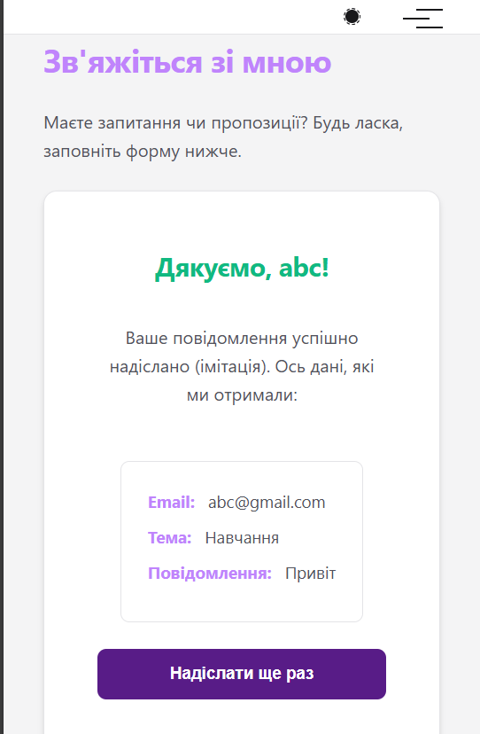
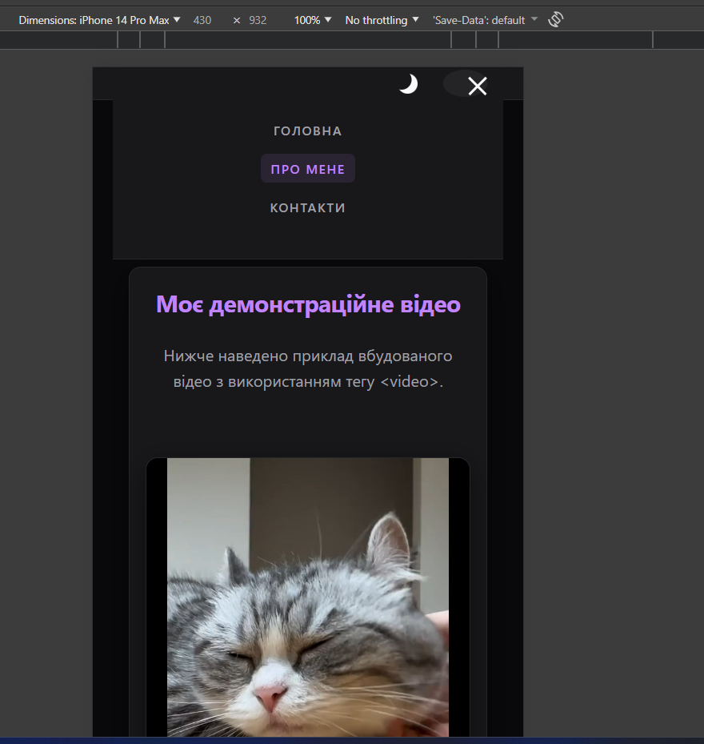

# Практична робота №3: Додавання JavaScript до HTML/CSS-мінісайту

Цей проект є розвитком міні-сайту з попередніх робіт. У цій частині додано реальну клієнтську логіку на JavaScript для покращення взаємодії з користувачем та додавання інтерактивності.

## Основні зміни (Lab 03)
- **Навігація:**
    - Реалізовано динамічне підсвічування активного пункту меню.
    - Створено функціональне мобільне меню ("бургер") з анімацією.
- **Теми оформлення:**
    - Додано перемикач світлої та темної тем.
    - Вибір користувача зберігається у `localStorage` та відновлюється при перезавантаженні сторінки.
- **Інтерактивні компоненти:**
    - **Back to Top:** Кнопка швидкого повернення вгору з'являється при прокрутці.
    - **Акордеон:** Секція FAQ на сторінці "Про мене" з розгорнутими відповідями.
    - **Фільтрація:** Динамічний фільтр карток за категоріями на головній сторінці.
    - **Модальне вікно (Lightbox):** Перегляд зображень у збільшеному вигляді при кліку.
- **Робота з формами:**
    - Реалізовано валідацію полів (ім'я, email, повідомлення) в реальному часі.
    - Додано лічильник символів для текстового поля.
    - **Чернетка:** Дані форми автоматично зберігаються в `localStorage` і відновлюються після оновлення сторінки.
    - Створено кастомну обробку відправки форми з відображенням підсумкових даних.

## Структура проекту
- `index.html`: Головна сторінка з фільтрами та лайтбоксом.
- `pages/about.html`: Сторінка з акордеоном FAQ.
- `pages/contact.html`: Сторінка з розширеною логікою форми.
- `js/main.js`: Основний файл зі скриптами проекту.
- `styles/style.css` & `styles/responsive.css`: Оновлені стилі для підтримки нових компонентів та тем.
- `assets/`: Медіа-файли.

## Як запустити
1. Відкрийте файл `index.html` у будь-якому сучасному браузері.
2. Спробуйте змінити тему, скористатися фільтрами або заповнити форму (дані збережуться навіть після оновлення сторінки).

## Скріншоти (Приклади інтерактивності)
- [Desktop-версія]

- [Mobile-версія]

---
**Виконав:** Студент Максим
**Рік:** 2026
