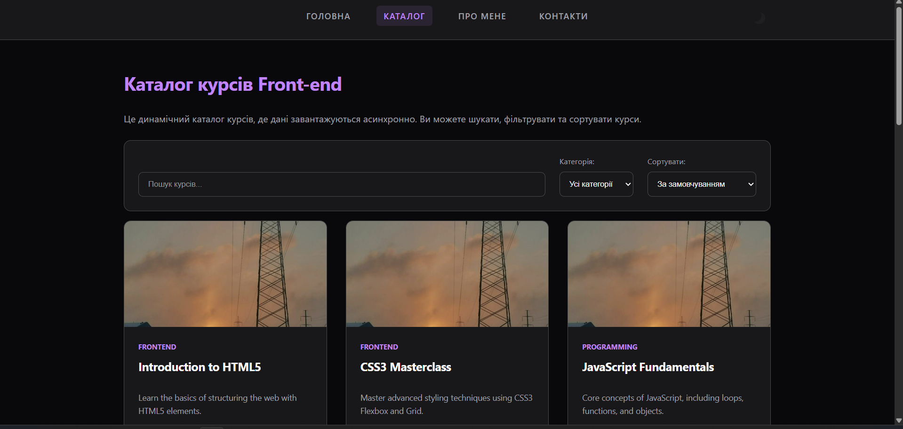
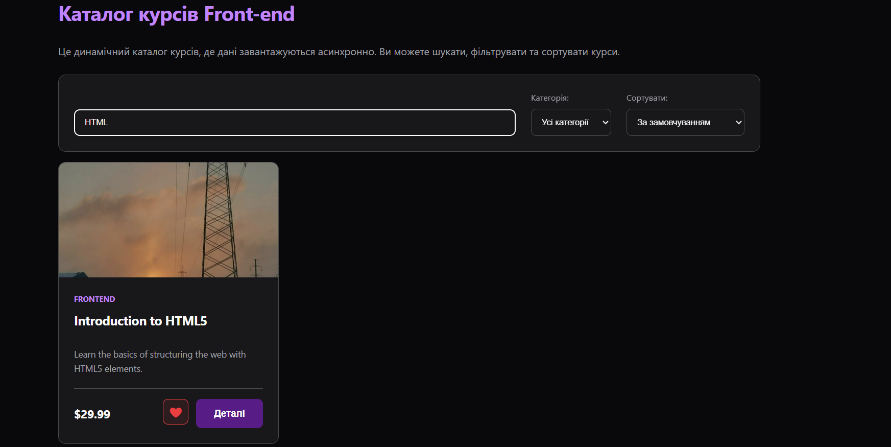
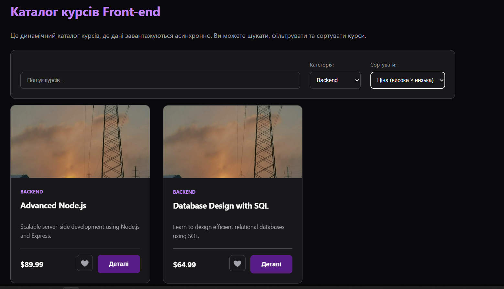
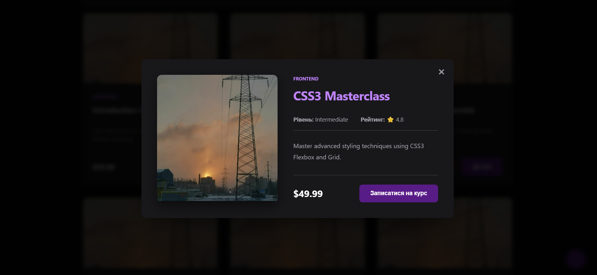

# Практична робота №9–10: Асинхронна робота з даними у JavaScript

Цей проект перетворює статичний HTML/CSS/JavaScript-мінісайт на **data-driven** вебпроєкт. Контент каталогу курсів завантажується асинхронно з JSON-файлу, що дозволяє динамічно керувати відображенням, пошуком та фільтрацією без ручного дублювання HTML.

## Основні можливості (Lab 04)
- **Асинхронне завантаження:**
    - Дані про курси зберігаються у файлі `data/items.json`.
    - Використано `fetch()` з `async/await` та обробкою помилок (`try/catch`).
- **Стани інтерфейсу:**
    - Реалізовано стани завантаження (**Loading**), порожнього результату (**Empty Result**) та помилки мережі (**Error State**).
- **Динамічний рендеринг:**
    - Картки курсів генеруються JavaScript на основі отриманого масиву об'єктів.
- **Інтерактивний каталог:**
    - **Пошук у реальному часі:** фільтрація за назвою та описом під час введення.
    - **Категорії:** фільтрація курсів за напрямками (Frontend, Backend, Design тощо).
    - **Сортування:** за ціною (зростання/спадання), рейтингом та назвою.
- **Обране (Favorites):**
    - Можливість додавати курси в "Обране".
    - Стан обраного зберігається у `localStorage` та відновлюється після перезавантаження сторінки.
- **Пагінація:**
    - Кнопка "Показати ще" для поступового завантаження контенту (по 6 елементів).
- **Деталі елемента:**
    - Модальне вікно з повною інформацією про вибраний курс (рівень, рейтинг, опис).

## Структура проекту
- `index.html`: Головна сторінка з каталогом та елементами керування.
- `data/items.json`: Локальна база даних курсів у форматі JSON.
- `js/api.js`: Модуль для завантаження даних.
- `js/catalog.js`: Модуль для рендерингу, фільтрації та сортування.
- `js/favorites.js`: Модуль для роботи з `localStorage` (обране).
- `js/main.js`: Головний модуль ініціалізації та обробки подій.
- `styles/style.css`: Оновлені стилі для сітки каталогу, карток та модальних вікон.

## Як запустити
1. Відкрийте файл `index.html` у браузері (бажано через локальний сервер, наприклад Live Server у VS Code, для коректної роботи `fetch()`).
2. Скористайтеся рядком пошуку або фільтрами для пошуку курсів.
3. Додайте курси в обране та переконайтеся, що вони залишаються вибраними після оновлення сторінки.

## Скріншоти
- 
- 
- 
- 

---
**Виконав:** Студент Максим
**Рік:** 2026
