# Lab 05: JS CRUD with REST API

Ця практична робота демонструє взаємодію фронтенду із сервером за допомогою REST API та CRUD-операцій.

## Реалізовані можливості

- **GET**: Отримання списку курсів та рендеринг каталогу.
- **POST**: Створення нового курсу через валідовану форму.
- **PATCH**: Редагування існуючих курсів.
- **DELETE**: Видалення курсів з підтвердженням.
- **Search & Filtering**: Пошук за назвою та фільтрація за категорією.
- **Sorting**: Сортування за ціною, рейтингом та часом додавання.
- **Pagination**: Посторінковий перегляд каталогу.
- **UI States**: Відображення станів завантаження, помилок та порожнього результату.

## Інструкція по запуску

Для роботи проекту необхідний локальний мок-сервер `json-server`.

1. Встановіть `json-server` (якщо ще не встановлено):
   ```bash
   npm install -g json-server
   ```

2. Запустіть сервер, використовуючи файл `db.json` в папці проекту:
   ```bash
   json-server --watch lab05-js-crud/db.json --port 3000
   ```

3. Відкрийте `lab05-js-crud/index.html` у браузері.

## Структура проекту

- `js/api.js`: Модуль для HTTP-запитів до API.
- `js/catalog.js`: Логіка відображення каталогу, фільтрації та видалення.
- `js/form.js`: Логіка форми створення та редагування.
- `js/ui.js`: Допоміжні функції для відображення станів інтерфейсу.
- `js/main.js`: Точка входу, ініціалізація сторінок.

## Скріншоти
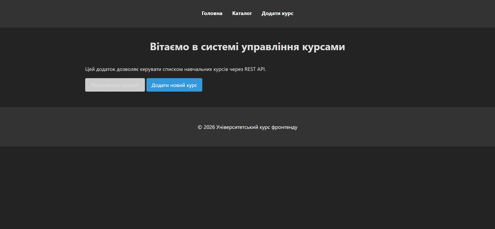
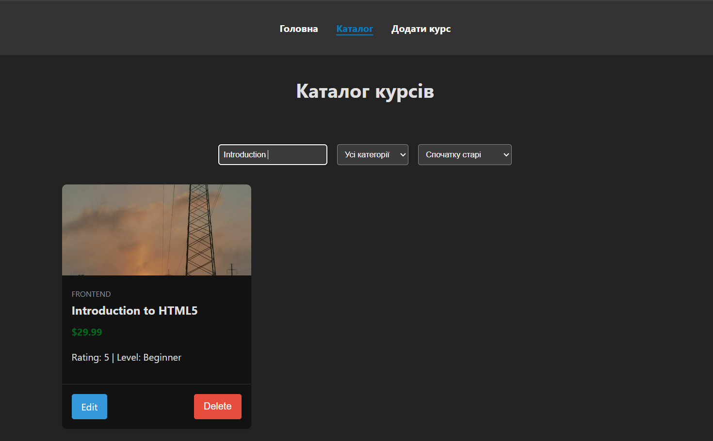
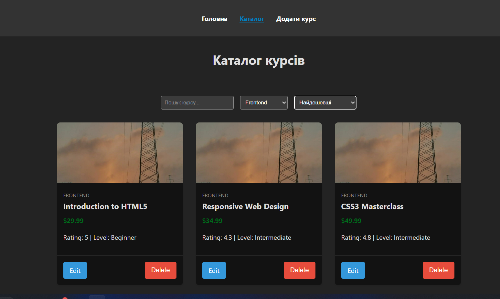
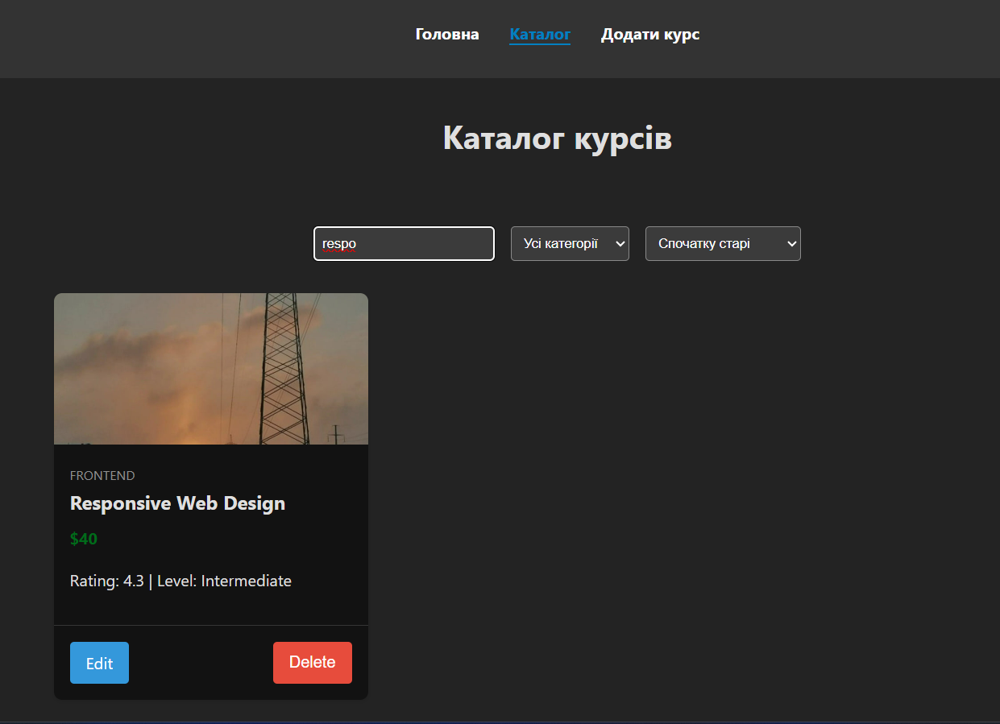
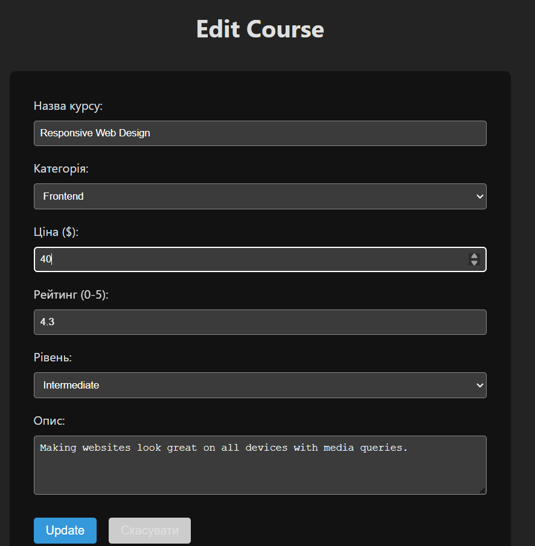
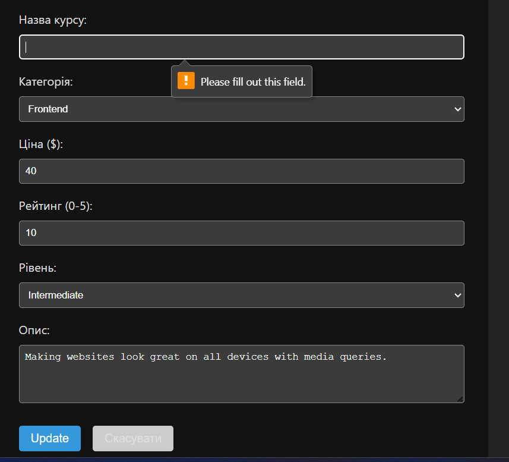
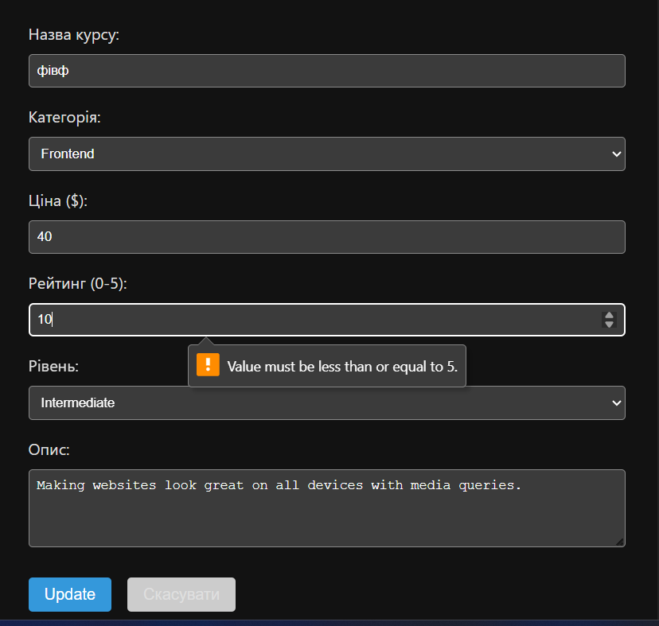
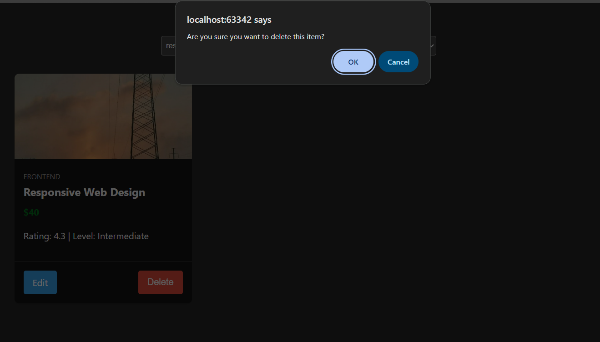
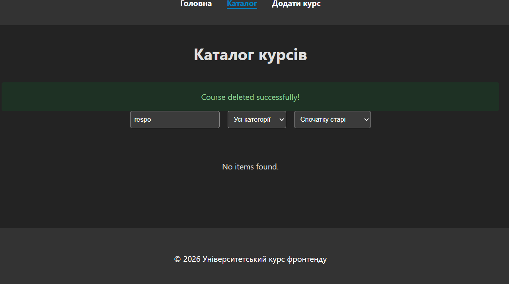
### Створення
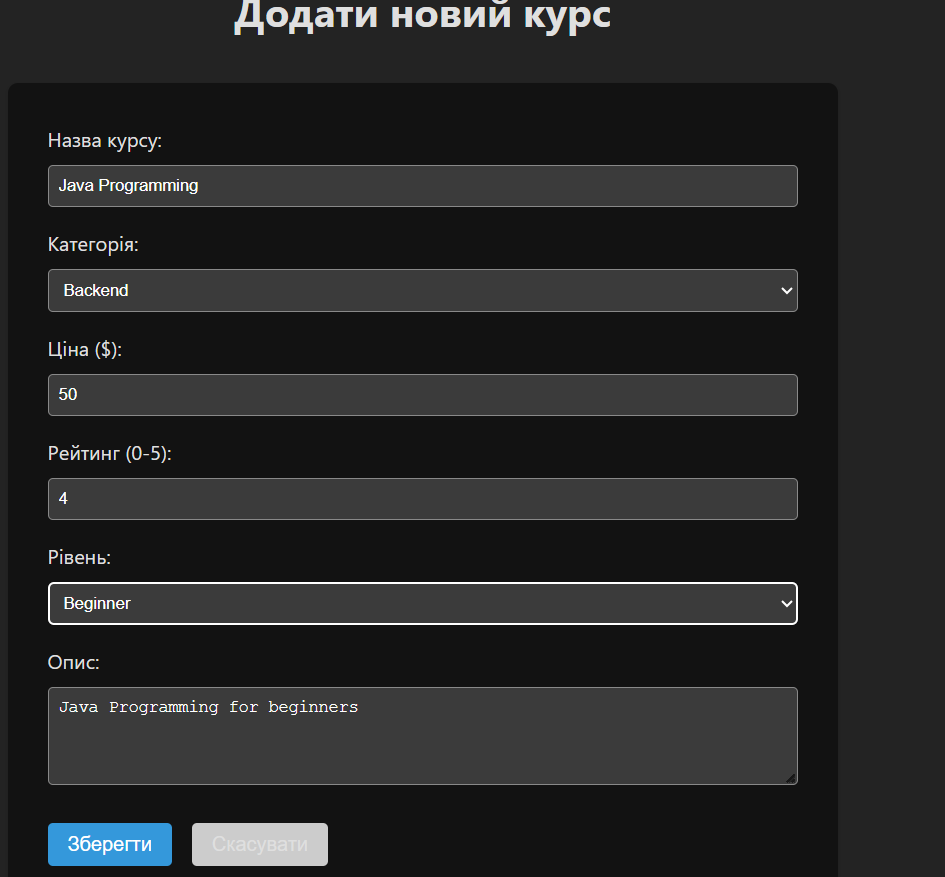
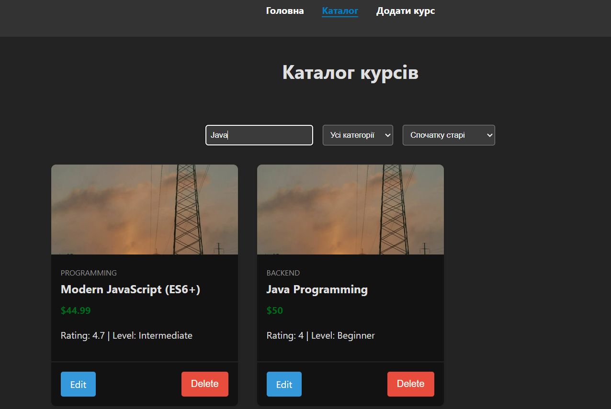